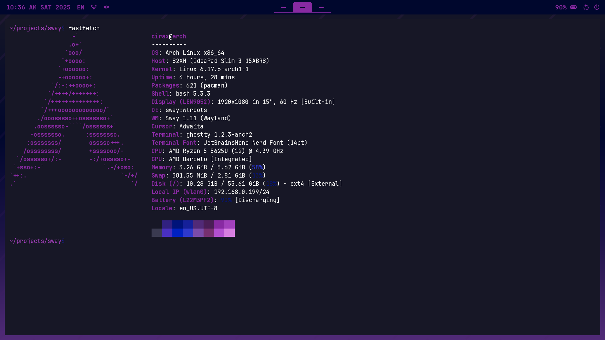

# Sway
This is my custom-made configuration for the Sway WM for Arch Linux. This repo contains all my dotfiles, the wallpaper, and also the full install script that installs everything for you, even my most-used apps. Please create an issue on this repo if you get any issues or errors with the installation, or if you'd appreciate any other custom app styling! **(Installation steps at the bottom)**

# Customizations
This configuration contains a wallpaper, customized waybar and dotfiles for apps found below.

# Keybinds
The keybinds are very different from a standard Sway installation, carried over from Hyprland. Here are the listed keybinds:
- Note the Mod key is set as the Windows key.

| Keybind              | Result                                         |
|----------------------|------------------------------------------------|
| Mod+Q                | Opens the terminal.                            |
| Mod+C                | Closes the active app.                         |
| Mod+R                | Opens WOFI.                                    |
| Mod+E                | Opens the file explorer.                       |
| Mod+Shift+C          | Refreshes Sway.                                |
| Mod+Arrow/hjkl       | Moves focus to the selected direction.         |
| Mod+Shift+Arrow/hjkl | Moves window to the selected direction.        |
| Mod+Number           | Moves to the desired workspace.                |
| Mod+Shift+Number     | Moves the active app to the desired workspace. |
| Mod+B                | Changes split to horizontal.                   |
| Mod+V                | Changes split to vertical.                     |
| Mod+S                | Changes mode to stacking.                      |
| Mod+W                | Changes mode to tabbed.                        |
| Mod+T                | Changes mode to split (default).               |
| Mod+Shift+Space      | Toggles floating mode and tiling mode.         |
| Mod+Minus            | Show scratchpad.                               |
| Mod+Shift+Minus      | Move the selected app to scratchpad.           |
| PrntSc               | Takes a screenshot and saves it to ~/          |

# Installation
1. Install Arch Linux with Sway, this will not work on any other WM or DE (or at least most of it).
2. Ensure you are connected to the internet.
3. Open the terminal using Win+Enter.
4. Run `bash <(curl -s https://raw.githubusercontent.com/Cirax856/sway/main/script.sh)`

# Apps
- Terminal: [Ghostty](https://ghostty.org/)
- Editor: [Neovim](https://neovim.io/)
- Browser: [Firefox](https://www.firefox.com/en-US/)
- Chat: [Vesktop (Discord)](https://vesktop.dev/)
